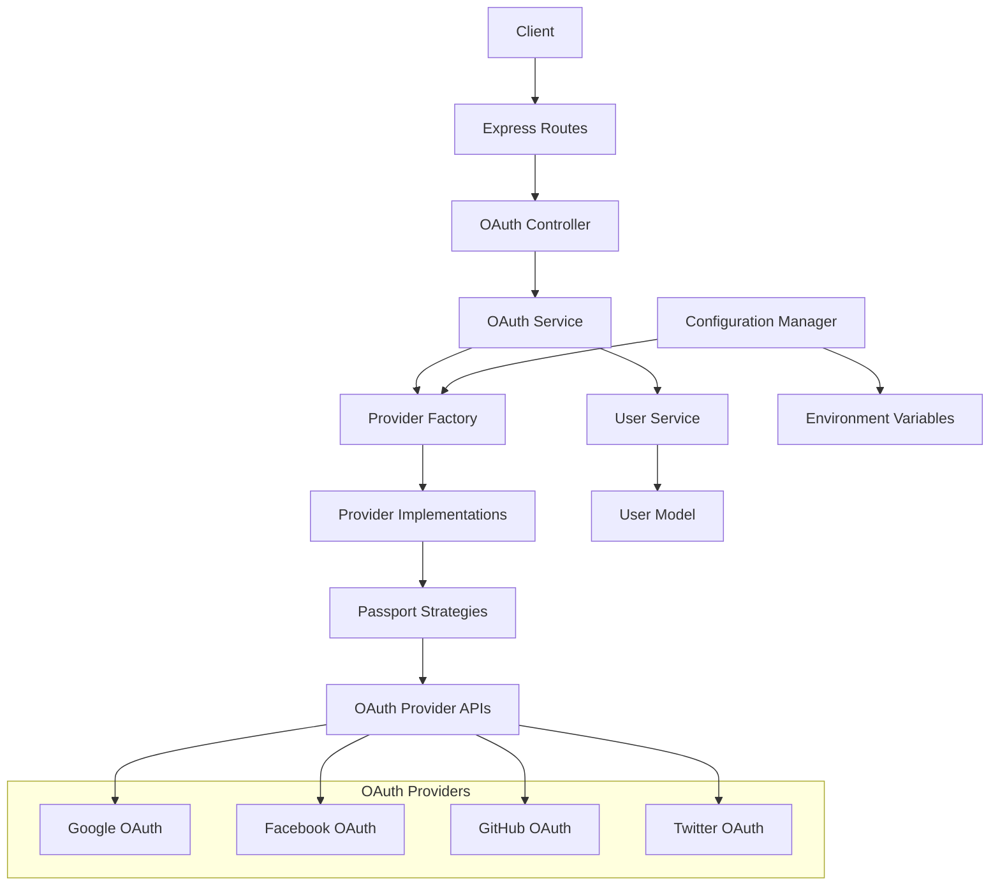

# Design Document

## Overview

The social authentication configuration system will extend the existing JWT-based authentication to support OAuth providers (Google, Facebook, Twitter, GitHub, etc.) through a unified, configuration-driven approach. The system will be built using Passport.js as the OAuth middleware, with a provider abstraction layer that allows easy addition of new OAuth providers through environment configuration only.

The design prioritizes flexibility and maintainability by creating a plugin-like architecture where OAuth providers can be enabled/disabled through configuration without code changes. The system will integrate seamlessly with the existing User model and authentication flow.

## Architecture

### High-Level Architecture



### Configuration-Driven Provider System

The system will use a configuration manager that reads OAuth provider settings from environment variables and dynamically enables/disables providers based on the availability of required credentials.

### Provider Abstraction Layer

Each OAuth provider will implement a standardized interface that handles:
- Strategy configuration
- User profile normalization
- Account linking logic
- Provider-specific error handling

## Components and Interfaces

### 1. Configuration Manager

**Purpose**: Centralized management of OAuth provider configurations

**Interface**:
```javascript
class OAuthConfigManager {
  getEnabledProviders()
  getProviderConfig(providerName)
  isProviderEnabled(providerName)
  validateProviderConfig(providerName)
}
```

**Responsibilities**:
- Read and validate environment variables
- Determine which providers are enabled
- Provide configuration objects to provider implementations
- Support hot-reloading of configurations

### 2. Provider Factory

**Purpose**: Dynamic creation and management of OAuth provider instances

**Interface**:
```javascript
class OAuthProviderFactory {
  createProvider(providerName, config)
  getAvailableProviders()
  initializeEnabledProviders()
}
```

**Responsibilities**:
- Instantiate provider implementations based on configuration
- Register Passport strategies for enabled providers
- Manage provider lifecycle

### 3. Provider Interface

**Purpose**: Standardized interface for all OAuth providers

**Interface**:
```javascript
class BaseOAuthProvider {
  constructor(config)
  getStrategy()
  normalizeProfile(profile)
  getAuthUrl(req)
  handleCallback(profile, done)
}
```

**Responsibilities**:
- Implement provider-specific OAuth logic
- Normalize user profiles to standard format
- Handle provider-specific errors and edge cases

### 4. OAuth Service

**Purpose**: Business logic for OAuth authentication flow

**Interface**:
```javascript
class OAuthService {
  authenticateWithProvider(providerName, profile)
  linkSocialAccount(userId, providerName, profile)
  unlinkSocialAccount(userId, providerName)
  findOrCreateUser(profile, providerName)
}
```

**Responsibilities**:
- Handle OAuth authentication flow
- Manage account linking/unlinking
- Integrate with existing user management system

### 5. OAuth Controller

**Purpose**: HTTP request handling for OAuth endpoints

**Interface**:
```javascript
class OAuthController {
  initiateAuth(req, res, next)
  handleCallback(req, res, next)
  linkAccount(req, res, next)
  unlinkAccount(req, res, next)
  getLinkedAccounts(req, res, next)
}
```

**Responsibilities**:
- Handle OAuth initiation and callback requests
- Manage account linking operations
- Provide user-facing OAuth account management

## Data Models

### User Model Extensions

The existing User model will be extended to support social authentication:

```javascript
// Additional fields for User model
{
  // Existing fields remain unchanged
  social_accounts: {
    type: DataTypes.JSON,
    allowNull: true,
    defaultValue: null,
    comment: 'Linked social media accounts'
  }
}
```

### Social Account Structure

```javascript
// Structure of social_accounts JSON field
{
  "google": {
    "id": "google_user_id",
    "email": "user@gmail.com",
    "name": "User Name",
    "avatar": "https://avatar_url",
    "linked_at": "2024-01-01T00:00:00Z"
  },
  "facebook": {
    "id": "facebook_user_id",
    "email": "user@facebook.com",
    "name": "User Name",
    "avatar": "https://avatar_url",
    "linked_at": "2024-01-01T00:00:00Z"
  }
}
```

### OAuth State Management

For security, OAuth state will be managed using the existing Token model:

```javascript
// OAuth state tokens
{
  token: "random_state_token",
  type: "oauth_state",
  user_id: null, // null for new registrations
  expires: Date,
  blacklisted: false,
  metadata: {
    provider: "google",
    redirect_url: "/dashboard",
    action: "login" // or "link"
  }
}
```

## Error Handling

### OAuth-Specific Error Types

```javascript
class OAuthError extends ApiError {
  constructor(provider, originalError, statusCode = 400) {
    super(statusCode, `OAuth ${provider} error: ${originalError.message}`);
    this.provider = provider;
    this.originalError = originalError;
  }
}

class ProviderNotEnabledError extends OAuthError {
  constructor(provider) {
    super(provider, new Error('Provider not enabled'), 400);
  }
}

class AccountLinkingError extends OAuthError {
  constructor(provider, reason) {
    super(provider, new Error(`Account linking failed: ${reason}`), 409);
  }
}
```

### Error Handling Strategy

1. **Configuration Errors**: Log and disable problematic providers
2. **OAuth Flow Errors**: Redirect to login with error message
3. **Account Linking Conflicts**: Provide clear user guidance
4. **Provider API Errors**: Graceful degradation with fallback options

## Testing Strategy

### Unit Tests

1. **Configuration Manager Tests**
   - Environment variable parsing
   - Provider enablement logic
   - Configuration validation

2. **Provider Implementation Tests**
   - Strategy creation
   - Profile normalization
   - Error handling

3. **OAuth Service Tests**
   - Authentication flow
   - Account linking/unlinking
   - User creation and matching

### Integration Tests

1. **OAuth Flow Tests**
   - Complete authentication flow with mock providers
   - Callback handling
   - Token generation and validation

2. **Account Management Tests**
   - Linking multiple providers
   - Unlinking providers
   - Conflict resolution

### Mock Provider Implementation

A mock OAuth provider will be created for testing purposes:

```javascript
class MockOAuthProvider extends BaseOAuthProvider {
  constructor(config) {
    super(config);
    this.mockUsers = config.mockUsers || [];
  }
  
  getStrategy() {
    return new MockStrategy(this.config, this.handleCallback.bind(this));
  }
  
  // Mock implementation for testing
}
```

## Security Considerations

### OAuth Security Best Practices

1. **PKCE Implementation**: Use Proof Key for Code Exchange where supported
2. **State Parameter**: Prevent CSRF attacks with cryptographically secure state tokens
3. **Scope Limitation**: Request minimal necessary permissions
4. **Token Security**: Encrypt stored OAuth tokens
5. **Session Management**: Integrate with existing session security

### Account Linking Security

1. **Email Verification**: Verify email ownership before linking accounts
2. **Existing Account Protection**: Prevent unauthorized account takeover
3. **Audit Logging**: Log all account linking/unlinking activities
4. **Rate Limiting**: Prevent abuse of OAuth endpoints

### Configuration Security

1. **Credential Protection**: Ensure OAuth secrets are properly secured
2. **Environment Validation**: Validate all configuration at startup
3. **Fallback Mechanisms**: Graceful handling of misconfigured providers

## Implementation Phases

### Phase 1: Core Infrastructure
- Configuration manager implementation
- Provider factory and base provider class
- OAuth service foundation
- Database schema updates

### Phase 2: Provider Implementations
- Google OAuth provider
- Facebook OAuth provider
- Basic OAuth controller and routes

### Phase 3: Account Management
- Account linking functionality
- User interface for managing linked accounts
- Comprehensive error handling

### Phase 4: Additional Providers & Polish
- GitHub, Twitter, and other providers
- Enhanced security features
- Performance optimizations
- Comprehensive testing suite